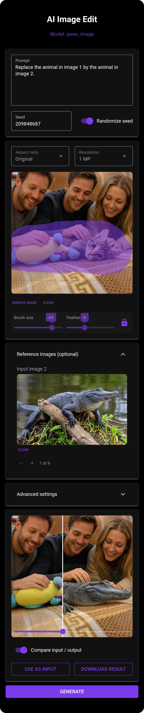

# AI Image Edit

A comfortable, responsive, model-agnostic app for AI-assisted image editing
and generation. It provides a web based UI optimized for mobile devices in
front of a pluggable image-generation backend.

| Feature | Description |
|---|---|
| Inpainting | Advanced inpainting and mask functionality with seamless soft blending |
| Before/after comparison | Interactive slider to compare generated outputs with the source |
| Aspect ratios | Presets for common, widely used aspect ratios |
| LoRAs | Optional LoRA support, auto-detected from a local loras folder |

Backends, selected with `MODEL_BACKEND`:

- **`qwen_image_edit_comfy`** (default) — Qwen-Image-Edit plus a curated set
  of LoRAs, driven through [ComfyUI](https://github.com/comfyanonymous/ComfyUI).
- **`qwen_image`** — a direct [diffusers](https://github.com/huggingface/diffusers)
  pipeline for Qwen-Image-2.1. Needs the separately licensed
  [`ai-image-edit-qwen`](https://github.com/pulb/ai_image_edit_qwen)
  package (see [License](#license)).

Frontends, selected with `FRONTEND`:

- **[NiceGUI](https://nicegui.io/)** (default) — the snappier frontend.
- **[Gradio](https://www.gradio.app/)** — fallback frontend, required for
  Hugging Face ZeroGPU.

The UI is served on port `7860`.

## Deployment

| Target | Backend | Frontend | Guide |
|---|---|---|---|
| Docker (self-hosted) | `qwen_image_edit_comfy`, `qwen_image` (one image each) | NiceGUI only | [`deployments/docker`](deployments/docker/DEPLOY.md) |
| Hugging Face Space | `qwen_image` | Gradio (ZeroGPU), Gradio or NiceGUI (paid GPU) | [`deployments/huggingface`](deployments/huggingface/DEPLOY.md) |
| RunPod GPU Pod | `qwen_image_edit_comfy`, `qwen_image` (one image each) | NiceGUI only | [`deployments/runpod`](deployments/runpod/DEPLOY.md) |

## License

Licensed under the GNU General Public License v3.0 or later
(GPL-3.0-or-later). See [`LICENSE`](LICENSE) for the full text.

The `qwen_image` backend depends on a separate package,
[`ai-image-edit-qwen`](https://github.com/pulb/ai_image_edit_qwen), which
is under the Qwen RESEARCH LICENSE AGREEMENT rather than the GPL, as are
the Qwen-Image-2.1 weights it loads. That agreement allows non-commercial
use (research or evaluation) only. This repository contains no code under
that license.

Copyright (C) 2026 AI Image Edit authors

## Screenshot

