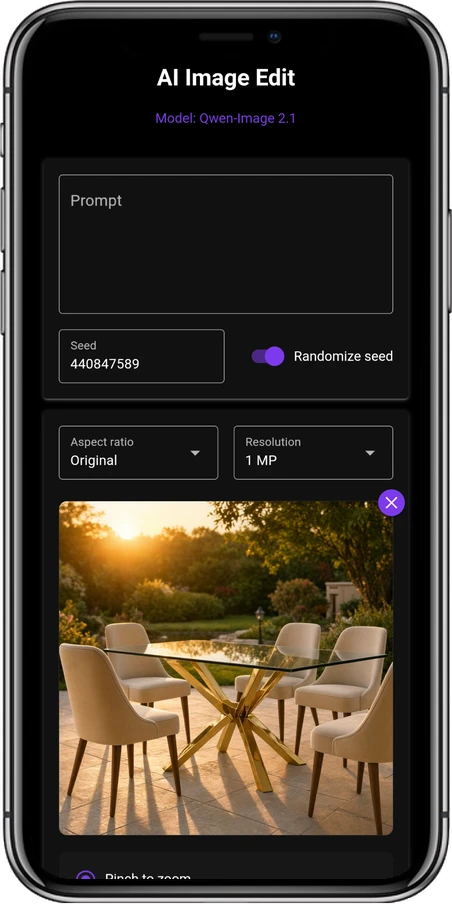
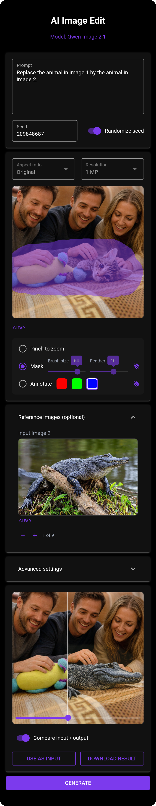
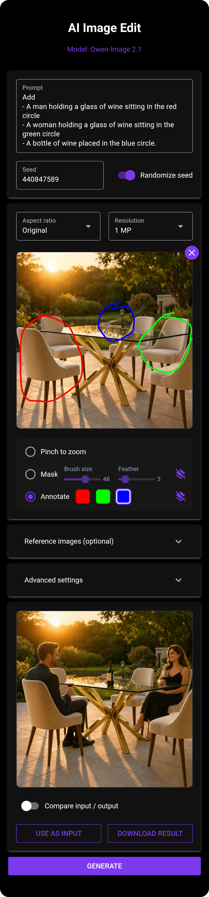
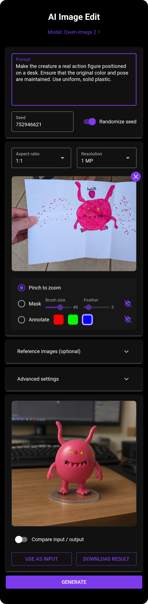
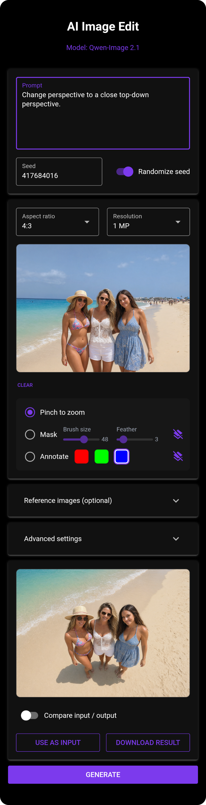

# AI Image Edit

A comfortable, responsive, model-agnostic app for AI-assisted image editing
and generation. It provides a web based UI optimized for mobile devices in
front of interchangeable image-generation models.

   
  
   
   

## Features

| Feature | Description |
|---|---|
| Privacy | Runs on your own hardware or in a disposable container, so your images and prompts stay under your control and vanish with it |
| Inpainting | Advanced inpainting and mask functionality with seamless soft blending |
| Annotations | Draw thin colored strokes directly on the image to point the model at what to change |
| Incremental edits | Feed any result back in as the next input to refine an image step by step |
| Before/after comparison | Interactive slider to compare generated outputs with the source |
| Aspect ratios | Presets for common, widely used aspect ratios |
| LoRAs | Optional LoRA support, auto-detected from a local loras folder |

## Model workflows

The models the app runs are interchangeable *model workflows*. You can select
one of the included workflows or even write your own (see
[Model workflows](doc/models.md)). The weights are downloaded when a model
starts. These are included:

- **`qwen_image21`** (default): Qwen-Image-2.1 in full quality, for GPUs with
  plenty of memory.
- **`qwen_image21_gguf`**: the same model, quantized, for GPUs with little
  memory, at some cost in quality.
- **`qwen_image_edit_2511_aio`**: Qwen-Image-Edit 2511 with a set of LoRAs, for
  fast edits in just a few steps.

The [deployments](#deployments) are already preconfigured. More details about
each workflow, its variants and licenses are in [doc/models.md](doc/models.md).

## Deployments

| Target | Model workflows | Guide |
|---|---|---|
| ⭐ **RunPod GPU Pod** (recommended) | all (one ComfyUI image) | [`deployments/runpod`](deployments/runpod/DEPLOY.md) |
| Hugging Face Space | the ComfyUI image as a Docker Space on a paid GPU | [`deployments/huggingface`](deployments/huggingface/DEPLOY.md) |
| Docker (self-hosted) | all (one ComfyUI image) | [`deployments/docker`](deployments/docker/DEPLOY.md) |

## Generation times

Approximate generation times by output resolution in megapixels (MP), at the
default of 40 steps. They are rough figures from single runs, not benchmarks,
and will vary with the step count and reference images.

### RunPod GPUs

The `qwen_image21` model (Qwen-Image-2.1) on the datacenter GPUs available on RunPod.

| GPU | 1 MP | 2 MP |
|---|---|---|
| NVIDIA H200 | ~10 s | ~1 min |
| NVIDIA A100 | ~20 s | ~2 min |
| NVIDIA L40S | ~23 s | insufficient mem |

### Consumer hardware

The `qwen_image21_gguf` model with the default `UC Q4_K_M` variant on GPUs you
may have at home. The RTX 4090 figures were measured with
`--highvram --disable-dynamic-vram` (see [Docker](deployments/docker/DEPLOY.md#comfyui-arguments-comfy_extra_args)),
the RTX 2000 Ada figures without. `qwen_image21` does not fit on these GPUs.

| GPU | 1 MP | 2 MP |
|---|---|---|
| NVIDIA RTX 4090 (24 GB) | ~31 s | ~2 min 40 s |
| NVIDIA RTX 2000 Ada (16 GB) | ~2 min 10 s | ~12 min |

## License

The code in this repository is licensed under the GNU General Public License
v3.0 or later (GPL-3.0-or-later). See [`LICENSE`](LICENSE) for the full text.

The third-party model and LoRA weights are not part of this repository and are
not under the GPL. They are downloaded from their publishers when a model
starts, and each has its own license. Check the licenses of the linked
repositories before use.

A model whose files carry a license that must be accepted is not downloaded
until you accept it with `ACCEPT_LICENSES`; the error names the license and its
URL. Custom nodes installed for a workflow keep their own licenses.

Copyright (C) 2026 AI Image Edit authors

## Examples

